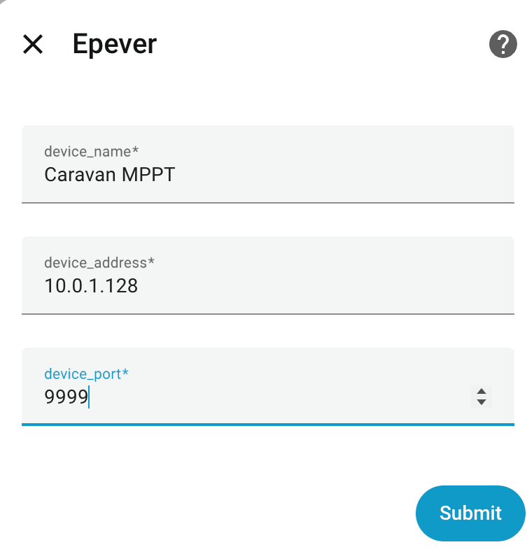
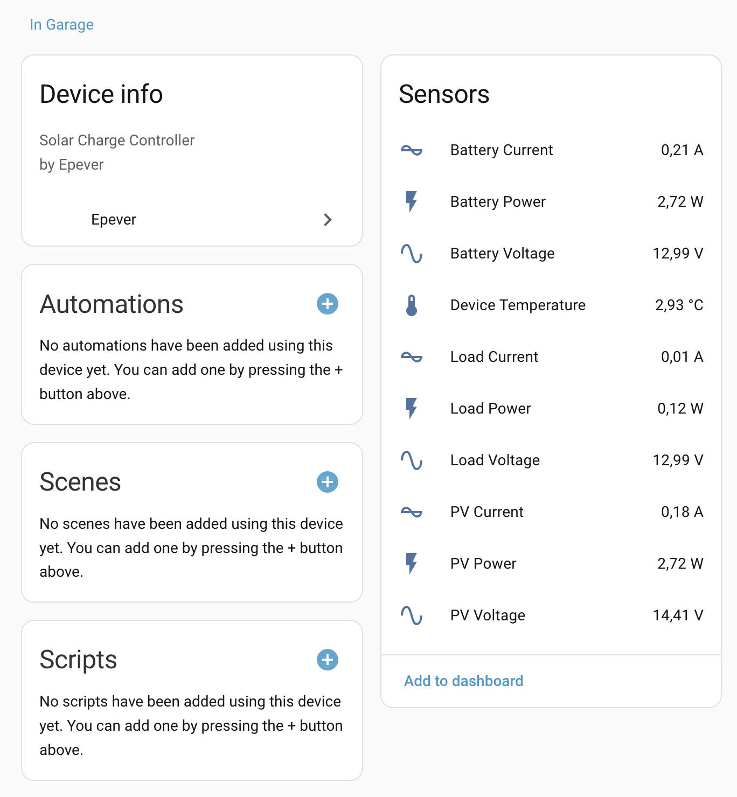

# Epever Integration for Home Assistant

Home Assistant integration for Epever solar charge controllers via Modbus TCP (WiFi dongle).

## Features

- Real-time monitoring of PV (solar panel) voltage, current, and power
- Battery voltage, current, and power monitoring
- Load voltage, current, and power monitoring
- Device temperature monitoring
- Configurable via UI (config flow)
- Supports Modbus TCP communication over WiFi

## Installation

### HACS (Home Assistant Community Store)

1. Open HACS in your Home Assistant instance
2. Go to **Integrations**
3. Click the three dots menu (⋮) in the top right corner
4. Select **Custom repositories**
5. Enter the following:
   - **Repository**: `https://github.com/zuzkins/ha-epever`
   - **Category**: `Integration`
6. Click **Add**
7. The integration will appear in HACS
8. Click **Download** to install it
9. Restart Home Assistant

### Manual Installation

1. Download the latest release from the [releases page](https://github.com/zuzkins/ha-epever/releases)
2. Extract the `zepever` folder
3. Copy the `zepever` folder to your `custom_components` directory in your Home Assistant configuration directory
4. Restart Home Assistant

## Configuration

1. Go to **Settings** → **Devices & Services**
2. Click **Add Integration**
3. Search for **Epever**
4. Enter the following information:
   - **Device Name**: A human-friendly name for your device
   - **Device Address**: The hostname or IP address of the WiFi dongle (e.g., `192.168.1.100` or `epever.local`)
   - **Device Port**: The TCP port for Modbus TCP communication (default: `9999`)
5. Click **Submit**

## Requirements

- Home Assistant 2024.1.0 or later
- Epever WiFi dongle connected to your charge controller
- Network connectivity between Home Assistant and the WiFi dongle
- Python package: `pymodbus==3.11.2` (installed automatically)

## Supported Sensors

- **PV Voltage** - Solar panel voltage
- **PV Current** - Solar panel current
- **PV Power** - Solar panel power output
- **Battery Voltage** - Battery voltage
- **Battery Current** - Battery current (positive = charging, negative = discharging)
- **Battery Power** - Battery power
- **Load Voltage** - Load output voltage
- **Load Current** - Load output current
- **Load Power** - Load power consumption
- **Device Temperature** - Charge controller temperature

## Troubleshooting

- **Integration not found**: Make sure you've restarted Home Assistant after installation
- **Connection errors**: Verify the device address (IP or hostname) and port are correct. Ensure the WiFi dongle is accessible from your Home Assistant instance
- **No data**: Check that your device address and port match your WiFi dongle configuration. Try pinging the device address to verify network connectivity

## Support

- [Issue Tracker](https://github.com/zuzkins/ha-epever/issues)

## License

This project is licensed under the MIT License.

## Screenshots

### Configuration

<picture></picture>

### Sensor Data

<picture></picture>
