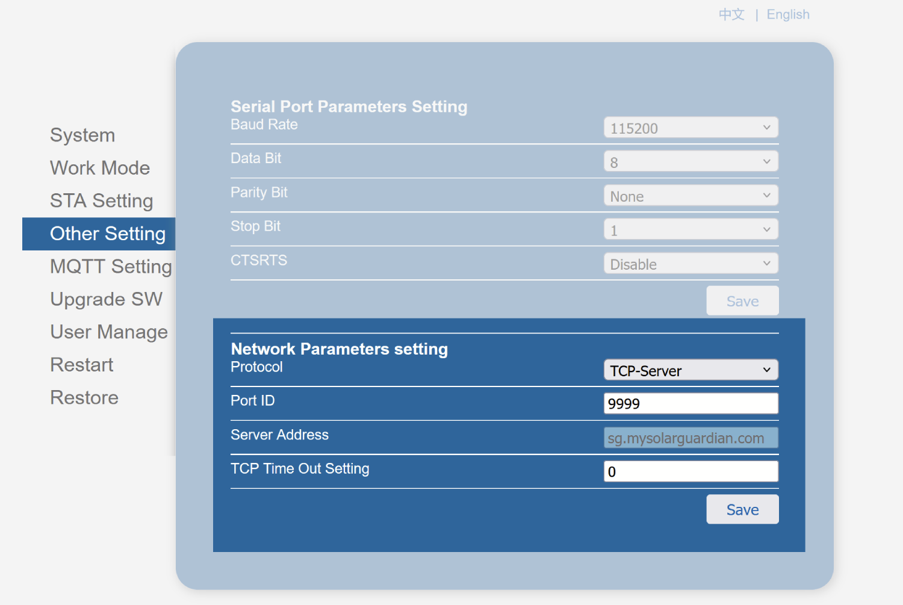
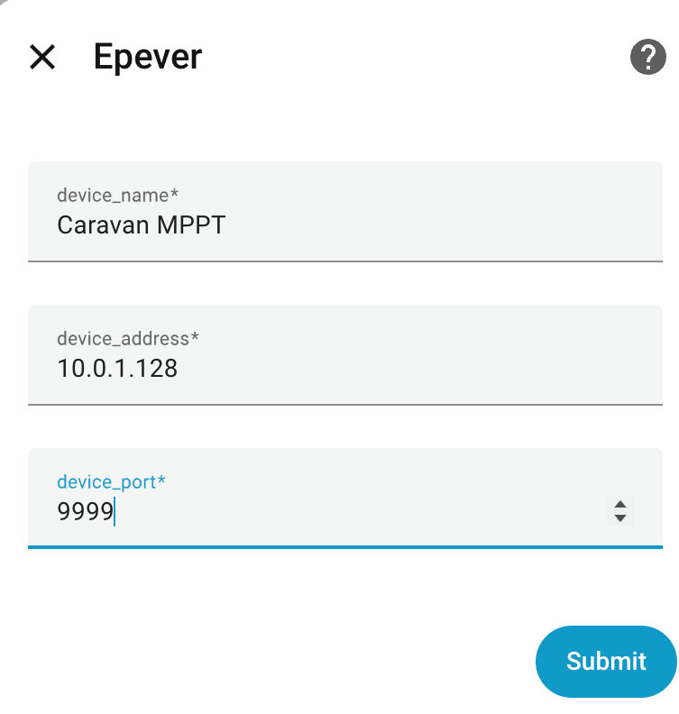
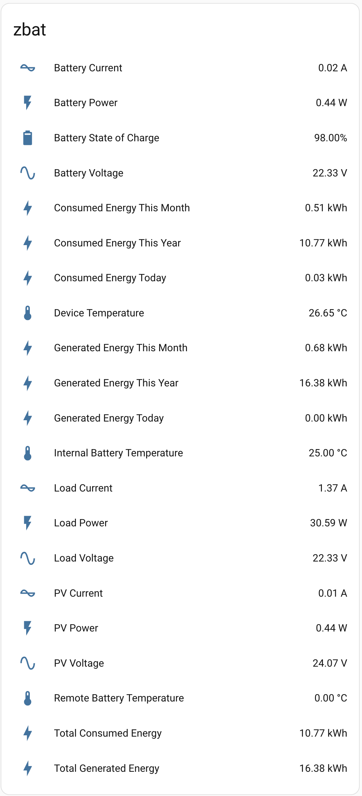

# Epever Integration for Home Assistant

[](https://www.hacs.xyz/)

Monitor an Epever solar charge controller locally in Home Assistant through an
Epever WiFi adapter. The integration reads live solar production, battery and
load measurements, temperatures, state of charge, and energy totals directly
from the controller without relying on the Epever cloud.

It is useful for:

- Seeing current PV production and battery status in one place
- Recording solar generation and load consumption history
- Using generated and consumed energy totals in the Home Assistant Energy dashboard
- Building automations for low battery state of charge, high temperature, or other conditions

```text
Solar panels -> Epever controller -> Epever WiFi adapter
                                             |
                                         WiFi LAN
                                             |
                                      Home Assistant
```

> [!IMPORTANT]
> The WiFi adapter must be configured as a **TCP Server** before Home Assistant
> can connect to it. This is not its factory-default mode. Follow the device
> setup below before installing the integration.

## Compatibility

The confirmed setup is:

- An Epever Tracer AN-series solar charge controller
- `EPEVER-WiFi-2.4G-RJ45-D` WiFi adapter

Other Epever controllers that expose the same Modbus register map may work, but
have not been verified. Please report results from other hardware in the issue
tracker.

The integration uses **Modbus RTU over TCP**.

### Requirements

- Home Assistant 2025.12.0 or later
- An Epever controller connected to a compatible WiFi adapter
- A 2.4 GHz WiFi network for the adapter
- Network connectivity from Home Assistant to the adapter
- A stable IP address for the adapter, preferably assigned with a DHCP reservation

## Set Up the Epever WiFi Adapter

### 1. Connect the adapter to WiFi

1. Connect the WiFi adapter to the communication port on the Epever controller.
2. Use the Epever or Solar Guardian app to connect the adapter to your 2.4 GHz WiFi network.
3. Find the adapter's IP address in the app or your router's list of connected devices.
4. Reserve that address in your router so it does not change later.

### 2. Enable TCP Server mode

1. Open `http://<device-ip>/` in a browser, replacing `<device-ip>` with the adapter's IP address.
2. Select **English** if needed.
3. Open **Other Setting**.
4. Under **Network Parameters setting**, set **Protocol** to `TCP-Server`.
5. Set **Port ID** to `9999`.
6. Set **TCP Time Out Setting** to `0`.
7. Click **Save** in the Network Parameters section.
8. Restart the adapter if the new setting does not take effect immediately.

Do not change the serial port parameters.



> [!NOTE]
> The adapter normally uses `TCP-Client` mode and port `15000` to connect to
> `sg.mysolarguardian.com`. Home Assistant cannot connect to the adapter in
> that mode. Changing it to `TCP-Server` provides local access and may stop
> Solar Guardian cloud reporting.

## Install the Integration

### HACS

This repository is not in the default HACS repository list, so add it as a
custom repository:

1. Open **HACS** in Home Assistant.
2. Select **Integrations**.
3. Open the three-dot menu and select **Custom repositories**.
4. Enter `https://github.com/zuzkins/ha-epever` as the repository.
5. Select **Integration** as the category and click **Add**.
6. Open the new **Epever** entry and click **Download**.
7. Restart Home Assistant.

<details>
<summary>Manual installation</summary>

1. Download the latest archive from the [releases page](https://github.com/zuzkins/ha-epever/releases).
2. Copy `custom_components/zepever` into the `custom_components` directory in your Home Assistant configuration directory.
3. Restart Home Assistant.

</details>

## Add the Device to Home Assistant

1. Go to **Settings > Devices & services**.
2. Click **Add Integration**.
3. Search for **Epever**.
4. Enter the connection details and click **Submit**.

| Field | Example | Description |
| --- | --- | --- |
| Device name | `Caravan MPPT` | The name shown in Home Assistant |
| Device address | `192.168.1.100` | The reserved IP address of the WiFi adapter |
| Device port | `9999` | The TCP Server port configured above |

Home Assistant tests the connection before creating the device. If submission
fails, work through the troubleshooting section below.



## What You Get

The integration polls the controller locally every five seconds and creates
entities for:

- PV voltage, current, and power
- Battery voltage, current, power, and state of charge
- Load voltage, current, and power
- Controller, battery, remote battery, and ambient temperatures
- Generated energy for today, this month, this year, and total
- Consumed load energy for today, this month, this year, and total

Generated and consumed energy entities use Home Assistant's energy device class
and can be selected in **Settings > Dashboards > Energy**. Consumed energy is
the energy measured on the controller's load output; it does not include loads
connected directly to the battery.



### Temperature readings

Some controllers report placeholder values when no temperature probe is
connected. In particular, a battery temperature fixed at `25.00 °C` or a
remote battery temperature fixed at `0.00 °C` can indicate a missing probe
rather than the actual temperature.

### Experimental MPPT reacquire control

The device includes a **Force MPPT reacquire** button and service. This is a
niche workaround for low-output solar arrays where the controller can remain at
a poor operating point instead of finding the available maximum power. It
temporarily halts solar charging to trigger a new MPPT sweep.

This control is not needed for ordinary operation and should not be used in
routine or repeated automations. It has only been verified on the development
hardware.

## Troubleshooting

### The integration cannot connect

- Confirm that the adapter's web interface opens at `http://<device-ip>/`.
- Confirm that **Protocol** is `TCP-Server`, not `TCP-Client`.
- Confirm that both the adapter and Home Assistant use port `9999`.
- Confirm that Home Assistant can reach the adapter's IP address across any VLANs or firewall rules.
- Check that the adapter's IP address has not changed.

### The device becomes intermittently unavailable

The Epever WiFi adapter accepts only one TCP client at a time. Close other apps,
scripts, or Modbus integrations that may be connected to the adapter.

### The integration does not appear in Home Assistant

Confirm that the integration is installed at
`config/custom_components/zepever` and restart Home Assistant. Refresh the
browser after the restart before searching for **Epever** again.

### Enable debug logging

Add the following to `configuration.yaml`, restart Home Assistant, and inspect
the logs while reproducing the problem:

```yaml
logger:
  logs:
    custom_components.zepever: debug
    pymodbus: debug
```

Remove the debug configuration after troubleshooting because Modbus logging is
verbose.

## Support

Report problems and unverified hardware results in the
[issue tracker](https://github.com/zuzkins/ha-epever/issues). Include the
controller model, WiFi adapter model, Home Assistant version, and relevant
debug logs.

## License

This project is licensed under the MIT License.
